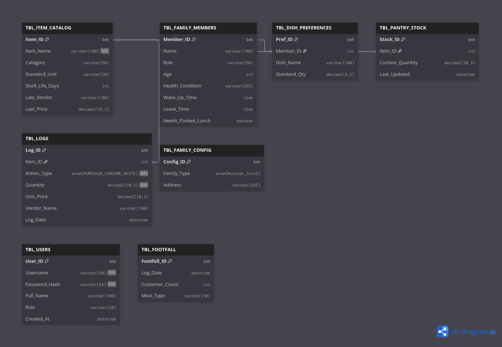

# Aahar Sathi - Smart Kitchen & Pantry Management System

## Overview

Aahar Sathi is a comprehensive software solution designed to optimize kitchen operations, reduce food waste, and streamline pantry management. Built with a focus on intelligent automation, the system leverages Artificial Intelligence to handle inventory tracking, meal planning, and procurement logistics. It serves as a central command center for managing household or commercial kitchen resources effectively.

**Repository:** [https://github.com/thevinay1712/pantryapp](https://github.com/thevinay1712/pantryapp)

## Key Features

### 1. Intelligent Inventory Management
* **Real-Time Tracking:** Monitors current stock levels, unit costs, and vendor details.
* **Expiry Management:** Automatically calculates shelf life and alerts users to critical items approaching expiration to prevent waste.
* **Dynamic Valuation:** Provides real-time valuation of total inventory assets.

### 2. AI-Driven Automation
* **Morning Rush Planner:** Generates optimized cooking schedules and meal plans based on family member availability, health conditions, and current pantry stock. It ensures recipes are suggested only if ingredients are available.
* **Bill Scanner:** Utilizes Computer Vision and LLMs (Groq/Llama) to parse physical grocery receipts and automatically update inventory records, eliminating manual data entry.
* **Leftover Wizard:** Suggests recipes to utilize leftover ingredients, minimizing food wastage.
* **Auto-Cataloging:** Automatically predicts categories and shelf life for new ingredients using AI analysis.

### 3. Analytics & Forecasting
* **Demand Forecasting:** Uses predictive modeling to estimate future consumption of specific ingredients.
* **Traffic Analysis:** Analyzes meal consumption patterns to predict future kitchen load (Footfall).
* **Visual Dashboard:** Features a modern, glassmorphism-styled command center with interactive Plotly charts for financial and operational insights.

### 4. Family & User Management
* **Profile Management:** Tracks individual family schedules, health conditions, and dietary requirements.
* **Role-Based Access:** Secure login system with hashed authentication for Administrators and Standard Users.

## Technical Architecture

* **Frontend:** Streamlit (Python) with custom CSS injection for a responsive, modern UI.
* **Backend Logic:** Python (Pandas, NumPy).
* **Database:** MySQL (Relational Data Model).
* **AI/ML Integration:**
    * **Groq API:** For high-speed inference of Llama models (Receipt OCR, Recipe Generation).
    * **Prophet:** For time-series forecasting of inventory demand.
* **Visualization:** Plotly Express.

## Database Schema

The system relies on a relational database structure designed to ensure data integrity across inventory, users, and consumption logs.



## Installation & Setup

### Prerequisites
* Python 3.8 or higher
* MySQL Server
* Groq API Key (for AI features)

### 1. Clone the Repository
```bash
git clone [https://github.com/thevinay1712/pantryapp.git](https://github.com/thevinay1712/pantryapp.git)
cd pantryapp

2. Install Dependencies
Bash

pip install -r requirements.txt

3. Environment Configuration

Create a .env file in the root directory with the following credentials:
Ini, TOML

DB_HOST=localhost
DB_USER=root
DB_PASSWORD=your_password
DB_NAME=aahar_sathi_db
GROQ_API_KEY=your_groq_api_key

4. Database Initialization

Before running the application, ensure the MySQL service is running. The application includes an automated setup script.

    Run the provided reset script or manually execute setup.sql in your MySQL client to create the necessary tables.

    The system creates a default admin account:

        Username: admin

        Password: password123

How to Run the Application

Once the database is initialized and dependencies are installed, execute the following command in your terminal:
Bash

streamlit run app.py

The application will launch in your default web browser at http://localhost:8501.
Usage Guidelines

    Dashboard: Upon logging in, the Command Center provides a high-level overview of inventory health.

    Catalog Entry: Use this module to register new ingredients. The AI Auto-Fill feature can populate shelf-life estimates.

    Morning Rush: Configure family schedules in "Family Setup" first. Then, use this module to generate a conflict-free cooking plan.

    Bill Scanner: Upload an image of a grocery receipt to bulk-import items. Verify the extracted data before committing to the database.

Security

    All user passwords are securely hashed using SHA-256 before storage.

    Database connections use environment variables to prevent credential exposure in the source code.